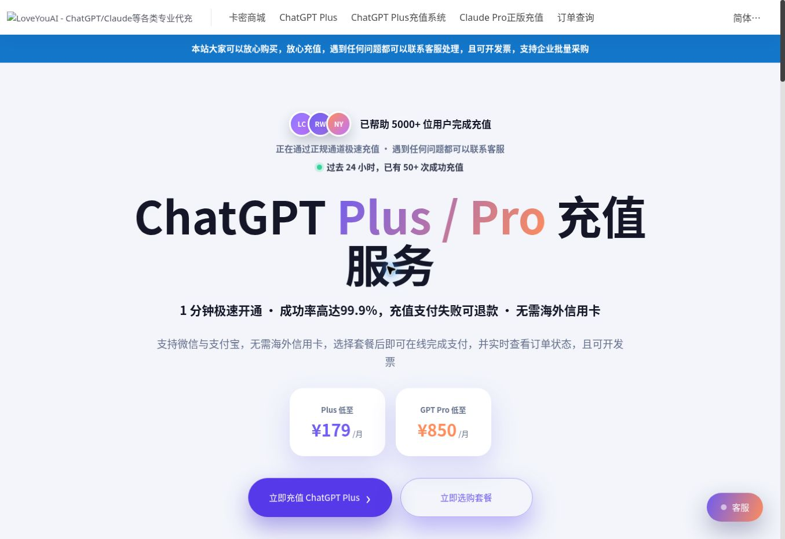
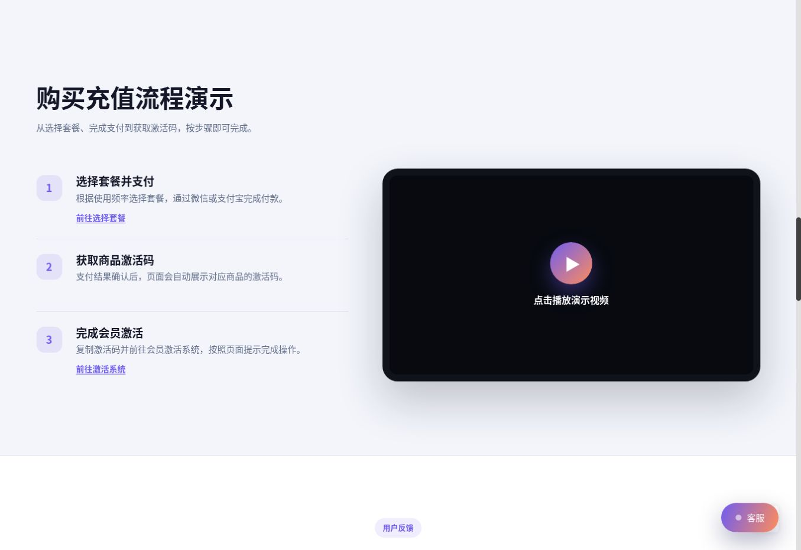

# 2026 ChatGPT Plus 充值教程：国内微信、支付宝开通与代充方法

[← 返回文章合集首页](../README.md)

> 本文更新于 2026 年 8 月 17 日。LoveYouAI 是第三方充值服务，并非 OpenAI 官方网站；套餐价格、交付方式和售后规则，请以下单页面的实时说明为准。

国内用户想开通 ChatGPT Plus，真正麻烦的往往不是“该不该买”，而是怎么付款。

ChatGPT 官网的订阅页面通常不能直接使用国内常见的银行卡、微信或支付宝。网上能找到的办法不少：虚拟信用卡、App Store 礼品卡、共享账号、朋友代付，以及第三方 ChatGPT Plus 代充。方法看着很多，操作门槛、安全性和实际成本却差别很大。

这篇文章把几种常见方式放在一起说清楚，也会重点介绍我自己在做的 ChatGPT Plus 代充网站 **LoveYouAI**。如果你不想研究海外信用卡和账单地址，只想用微信或支付宝完成付款，可以直接查看：

👉 **[LoveYouAI：ChatGPT Plus / Pro 充值入口](https://www.loveyouai.cn/chatgpt?ref=aicode)**

## 先说结论：国内怎么充值 ChatGPT Plus？

- **有稳定的海外支付方式：** 优先考虑在 ChatGPT 官网直接订阅，账号和付款都由自己管理。
- **熟悉苹果生态：** 可以研究 App Store 礼品卡，但要处理 Apple ID 地区、余额和潜在税费。
- **没有海外卡，又不想折腾：** 可以选择支持人民币付款、订单可查询、售后规则明确的代充服务。
- **共享账号：** 价格可能最低，但账号不属于自己，聊天记录和文件也存在隐私风险，不建议长期使用。

对大多数没有海外信用卡的国内用户来说，代充的优势不是“比官网便宜”，而是把支付这件事变简单。选择平台时，别只看价格，还要看付款方式、交付步骤、订单查询、退款说明和客服入口。

## 一、ChatGPT Plus 代充：不想折腾时最直接的办法

### 代充到底是怎么操作的？

第三方代充并不是共享账号。正常流程是在你自己的 ChatGPT 账号上完成会员升级，账号仍然由你本人使用。

以 LoveYouAI 当前页面展示的流程为例：

1. 根据使用频率选择 ChatGPT Plus 或 Pro 套餐；
2. 使用页面支持的微信或支付宝完成付款；
3. 支付确认后获取商品激活码；
4. 进入充值系统，按照页面提示完成会员激活；
5. 回到 ChatGPT 的设置或套餐页面，确认账号已经显示 Plus 或 Pro。

👉 **[前往 LoveYouAI 选择 ChatGPT 充值套餐](https://www.loveyouai.cn/chatgpt?ref=aicode)**

### 为什么把代充放在第一种？

因为很多人卡住的地方不是不会使用 ChatGPT，而是没有海外信用卡，也不想为了一个月的订阅去研究虚拟卡平台、账单地址和 Apple ID 切区。

代充更适合这些情况：

- 没有可用于海外订阅的信用卡；
- 希望用微信或支付宝付款；
- 使用安卓、Windows 或网页端，没有苹果设备；
- 临时急用 Plus，希望尽快完成开通；
- 公司采购，需要咨询发票或批量购买；
- 不想反复测试虚拟卡和支付环境。

LoveYouAI 页面目前提供自助充值、订单状态查询、客服和开票说明。充值失败的处理方式也写在页面上，购买前可以先把商品说明和售后规则看完。

### LoveYouAI 的充值流程

整个流程可以简单理解为“选套餐—付款—拿激活码—完成激活”。第一次使用时，建议不要跳过商品说明，也不要连续重复下单。付款后先保存好订单号和激活码，遇到问题时方便查询。

### 选择代充平台时，我会看这几点

1. 页面有没有明确写清套餐、价格和交付方式；
2. 付款后能不能查询订单状态；
3. 充值失败后怎么处理，退款边界是否清楚；
4. 有没有能联系到的客服；
5. 是否支持自己操作，而不是把账号密码直接交给陌生人；
6. 公司采购时能不能咨询发票；
7. 网站是不是持续维护，而不是临时收款页面。

这些条件不能代表绝对没有风险，但至少能让购买、交付和售后都有迹可查。

### 代充的优点

- 不需要自己申请虚拟信用卡；
- 国内支付更方便，实际方式以结算页为准；
- 充值到自己的账号，不是多人共用账号；
- 页面提供订单、激活和客服入口；
- 可以咨询发票及企业采购；
- 对第一次开通 Plus 的用户更省时间。

### 代充需要注意什么？

- 第三方服务不能等同于 OpenAI 官网直付；
- 套餐价格可能随汇率、库存和渠道成本变化；
- 下单前要确认账号当前是否已经有订阅，避免周期冲突；
- 激活码属于数字商品，购买后应妥善保管并尽快按说明使用；
- 不要把银行卡密码、支付验证码或 API Key 交给任何人；
- 充值完成后，应回到 ChatGPT 账号内确认套餐状态。

如果这些规则都能接受，再考虑下单：

👉 **[LoveYouAI ChatGPT Plus 代充入口](https://www.loveyouai.cn/chatgpt?ref=aicode)**

## 二、虚拟信用卡：自主，但需要自己处理支付问题

虚拟信用卡是很多海外订阅教程都会提到的方式。基本思路是注册一个支持国际在线支付的虚拟卡平台，完成开卡和充值后，再去 ChatGPT 官网填写卡号、有效期、CVV 和账单信息。

它最大的好处是自主。订阅关系在自己的 OpenAI 账号里，付款方式也由自己管理。如果以后还准备订阅 Claude、Midjourney、海外云服务或域名服务，这张卡也可能继续使用。

问题是，实际门槛没有看起来那么低。你可能要处理：

- 平台注册、认证、开卡和充值；
- 开卡费、充值费、月费或汇率损耗；
- 卡段被拒、支付失败或续费失败；
- 网络环境和账单地址；
- 平台停止运营后的余额处理。

第一次接触海外支付的人，很容易在其中某一步卡住。也不要只参考几年前的教程，因为虚拟卡平台和支付规则会变化。

**更适合：** 有海外支付经验，愿意长期自己管理订阅的人。

**不太适合：** 只想马上开通 Plus，不愿意研究支付风控的人。

## 三、App Store 礼品卡：苹果用户可以研究

如果你有 iPhone 或 iPad，可以考虑通过 ChatGPT 官方 App 的苹果内购订阅。

常见流程是：准备符合要求的 Apple ID，购买与商店地区一致的 Apple Gift Card，把余额兑换进账户，再登录 ChatGPT App 完成升级。

这条路走的是苹果内购体系，不用再绑定虚拟信用卡，订阅也可以在 Apple 账户中管理。不过，操作前要留意这些问题：

- Apple ID 地区和礼品卡地区必须一致；
- 切换地区可能影响原有订阅、余额和家庭共享；
- 礼品卡通常按固定面额出售，可能留下余额；
- 礼品卡存在渠道溢价，余额还要覆盖可能产生的税费；
- 第三方礼品卡来源需要谨慎核对。

**更适合：** 有苹果设备，也熟悉 Apple ID 和礼品卡流程的人。

**不太适合：** 安卓、网页端用户，或者不想调整 Apple ID 的人。

## 四、共享账号：便宜，但不建议长期使用

共享账号的模式很简单：商家提供一组邮箱和密码，多个人登录同一个 Plus 账号。它的优势几乎只有价格低，问题却不少。

- 其他用户可能看到聊天记录；
- 上传的代码、文档和图片可能泄露；
- 密码可能随时被修改；
- 多人异地登录容易触发验证或限制；
- 使用次数可能受限；
- 账号失效后，通常很难追责。

如果只是临时看看 Plus 界面，而且完全不输入隐私内容，可以自行权衡。只要涉及工作资料、简历、合同、客户信息或代码，就不要使用共享账号。

## 四种 ChatGPT Plus 充值方式对比

| 方式 | 操作难度 | 账号掌控 | 主要成本 | 更适合谁 | 建议 |
| --- | --- | --- | --- | --- | --- |
| 第三方代充 | 低 | 自己的账号 | 人民币套餐价 | 没有海外卡、希望微信/支付宝付款的人 | 重点看流程和售后 |
| 虚拟信用卡 | 高 | 自己的账号 | 订阅费及开卡、充值费用 | 熟悉海外支付的人 | 谨慎尝试 |
| App Store 礼品卡 | 中 | 自己的账号 | 礼品卡溢价及潜在税费 | 熟悉苹果生态的人 | 可以考虑 |
| 共享账号 | 低 | 不掌控账号 | 通常最便宜 | 只做无隐私的临时测试 | 不推荐 |

如果已经有符合要求的海外银行卡，官网直付仍然是最直接的选择。没有海外卡，又希望使用人民币付款，代充会更符合实际情况。

## ChatGPT Plus 充值常见问题

### 微信可以直接充值 ChatGPT Plus 吗？

微信通常不能直接用于 OpenAI 官网收银台。国内用户可以通过支持微信付款的第三方平台购买充值服务，再按照卡密和充值系统的流程完成开通。具体支付方式以结算页面为准。

### 支付宝可以直接充值 ChatGPT Plus 吗？

支付宝一般也不会直接出现在 ChatGPT 官网的付款页面。LoveYouAI 页面展示了微信和支付宝付款选项；如果页面规则发生变化，以下单时实际显示为准。

### 代充需要提供 ChatGPT 密码吗？

不同平台的交付方式不完全一样，不能一概而论。LoveYouAI 当前使用卡密和自助充值系统，具体需要提交的内容以充值页面说明为准。无论使用哪家平台，都不应提供银行卡密码、支付验证码或 API Key。

### 付款后没有看到激活码怎么办？

先确认订单是否支付成功，再查看订单详情是否已经展示激活码。仍未显示时，保存订单号和付款记录，通过网站客服查询，不要连续重复购买。

### 充值后聊天记录还在吗？

如果会员开通在你自己的原账号上，正常的套餐升级不会因为“变成 Plus”而主动清空历史聊天。购买前要确认商品不是新账号或共享账号。

### 已经有 Plus，还能提前充值吗？

不同渠道和商品的规则可能不同。账号已经有订阅时，先查看当前到期时间，再向平台确认是否支持续费，避免剩余周期无法顺延。

### 充值完成后去哪里查看？

登录 ChatGPT，进入设置、Account、Plan 或 Subscription 页面查看当前套餐。账号内显示 Plus 或对应套餐状态，才算最终确认到账。

### ChatGPT Plus 包含 API 额度吗？

不包含。ChatGPT Plus 是 ChatGPT 产品订阅，OpenAI API 使用独立的计费体系。

## 最后怎么选？

选择之前，先问自己三个问题：

1. 我愿不愿意研究海外支付？
2. 我能不能接受第三方服务带来的溢价和规则？
3. 我对账号隐私、订单查询和售后的要求有多高？

愿意折腾、也有支付经验，可以优先研究官网直付或虚拟信用卡；熟悉苹果生态，可以考虑 App Store；只是临时体验，也不要在共享账号里放任何重要内容。

如果你没有海外卡，只想用微信或支付宝完成 ChatGPT Plus 充值，可以先查看 LoveYouAI 的套餐、交付步骤和售后说明，确认适合自己再购买：

👉 **[LoveYouAI：国内 ChatGPT Plus / Pro 充值](https://www.loveyouai.cn/chatgpt?ref=aicode)**
